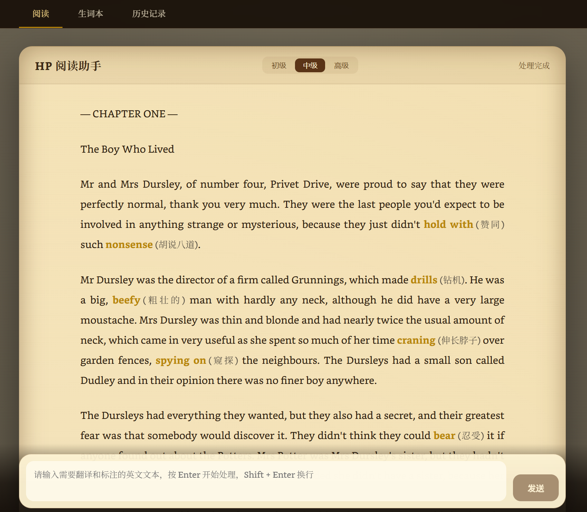
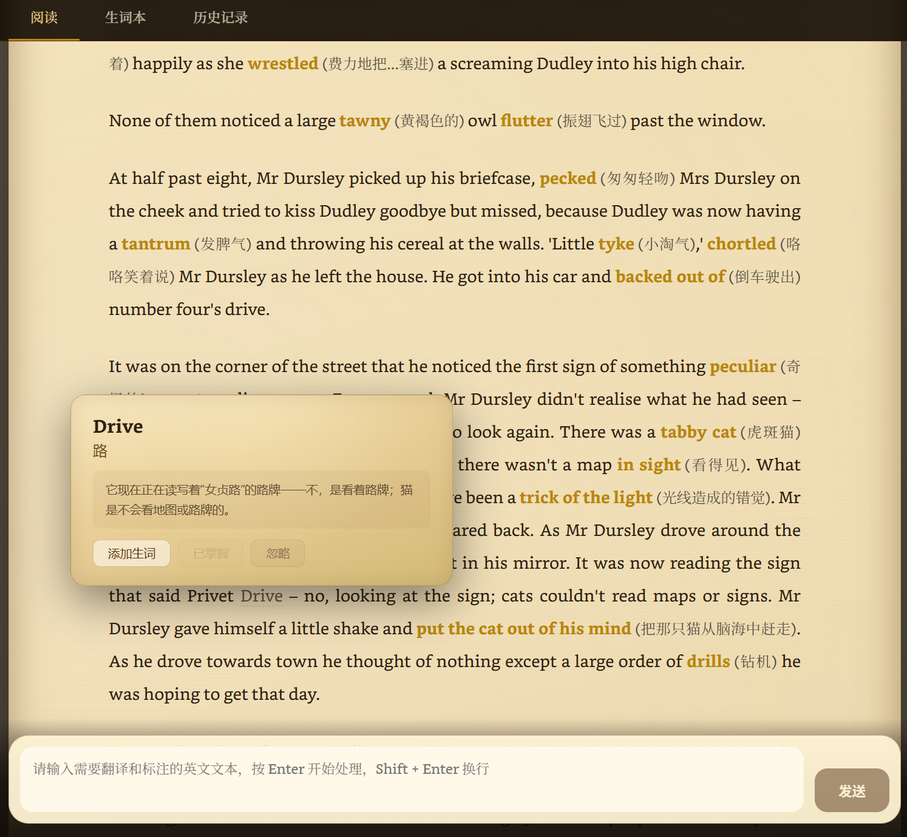
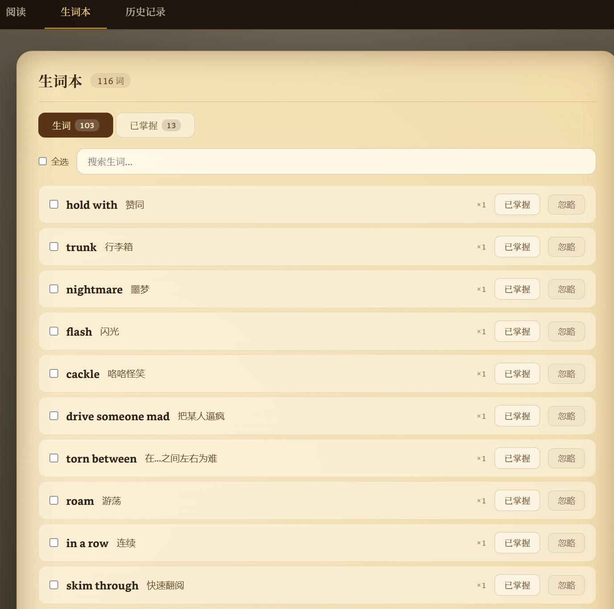
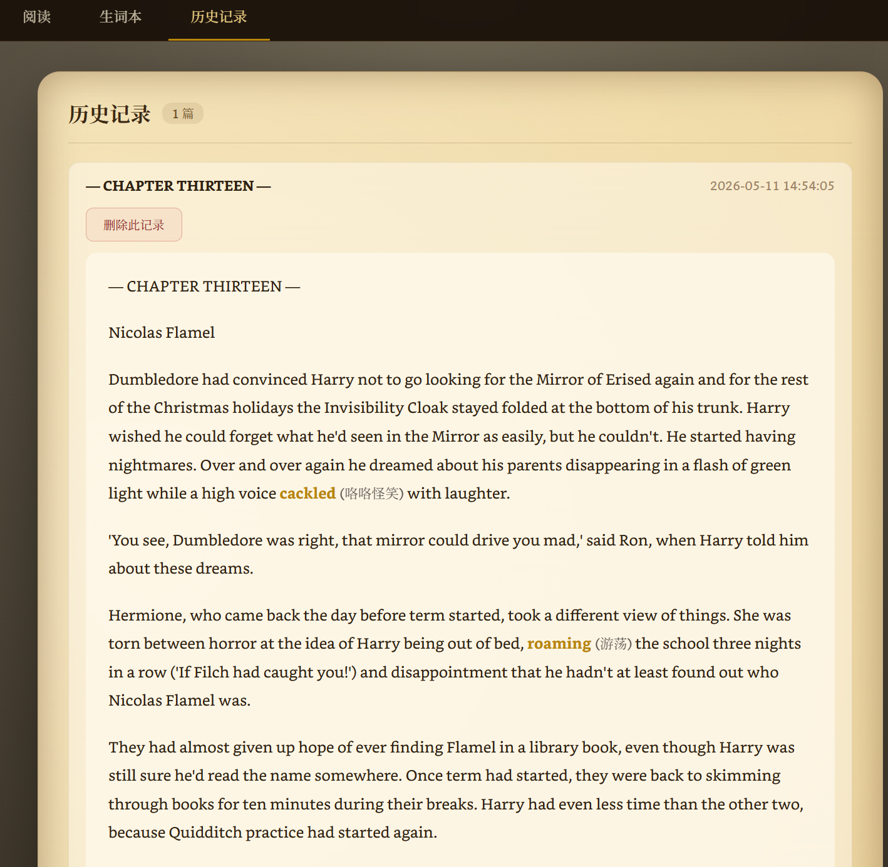

# HP-Agent

> 英文原著阅读助手：面向英文小说、原版读物和长文本阅读场景，自动识别生词、短语、专有名词和上下文表达，并在原文中插入中文释义，帮助用户更顺畅地完成英文阅读。

HP-Agent 是一个基于 FastAPI、Vue 3 和 LLM 的英文阅读辅助工具。用户输入英文段落后，系统会按照所选阅读水平自动完成生词标注、中文释义插入和流式渲染；同时支持生词本、历史记录、点击查词和已掌握词过滤等功能，适合用于英文原著阅读、语言学习和专业术语理解。

当前项目以《哈利·波特》英文原著片段作为示例阅读场景，因此在提示词和页面风格上保留了魔法术语、人物称谓、小说叙事语境和羊皮纸视觉风格等设计。项目本身并不局限于《哈利·波特》，后续可以通过调整系统提示词、术语识别规则和前端主题，扩展到其他英文小说、专业教材、技术文档或新闻文章等阅读场景。

## 项目定位

本项目的核心定位是“英文原著阅读助手”，重点解决用户在阅读英文长文本时遇到的三类问题：生词影响理解、长句和上下文翻译成本较高、已学词汇缺少持续管理。

《哈利·波特》在本项目中主要作为示例阅读场景，用来展示系统如何处理英文小说中的人物、地点、魔法术语和叙事表达。例如，系统可以针对 spell、wand、Muggle、Hogwarts 等具有作品语境的词汇给出更符合小说背景的中文解释，而不是只提供普通词典释义。

由于不同阅读材料的难点不同，系统提示词可以根据具体场景继续优化。例如，阅读英文小说时可以强调人物关系、习语和叙事语气；阅读计算机技术文档时可以强调 API、命令、参数和专业术语；阅读学术论文时可以强调领域概念、方法名称和句子逻辑。这样可以让同一套阅读工具更好地适配不同类型的英文文本。

## 核心功能

### 阅读批注

- 支持输入英文文本，并由 LLM 自动识别生词、短语、专有名词和场景化术语。
- 使用 `[[word|中文释义]]` 标记格式，前端可稳定解析并高亮显示。
- 提供初级、中级、高级三种阅读水平，用于控制标注密度和解释深度。
- 支持 SSE 流式输出，处理进度实时展示，减少长文本等待感。
- 前端采用羊皮纸风格页面和 Bookerly 衬线字体，提升沉浸式阅读体验。

### 生词管理

- 自动累积生词，支持跨会话保存。
- 支持搜索、添加、忽略和标记已掌握。
- 已掌握词按时间排序，并可在阅读页面中自动过滤标注。
- 原始批注结果保持不变，是否显示翻译由前端根据 `masteredWords` 集合动态控制。

### 历史记录与点击查词

- 每次完成批注后自动保存翻译历史。
- 支持历史记录查看、展开和删除。
- 阅读页面支持点击单词弹出查词气泡。
- 查词气泡同时展示单词释义和整句翻译，并支持添加生词、标记已掌握和忽略。

### 性能与稳定性

- 长文本按段落和词数切分为 chunk。
- 使用 `asyncio.Semaphore(3)` 控制并行请求数量，提升整体处理速度。
- 对 DeepSeek v4-pro 关闭 thinking mode，降低翻译标注任务的响应耗时。
- 使用 SQLite 进行本地持久化，减少额外部署依赖。
- 已加入去重、超时保护、错误处理、并发安全和响应式状态重构等优化。

## 运行截图

<div align="center">
  
  <p><em>阅读页面 — 羊皮纸主题 + 生词暗金色高亮 + 三级水平选择器</em></p>

  
  <p><em>点击查词气泡弹窗 — 词翻译 + 句翻译 + 添加生词/标记已掌握</em></p>

  
  <p><em>生词本 — 搜索/全选/批量标记已掌握/忽略</em></p>

  
  <p><em>历史记录 — 翻译历史回看/展开详情/删除</em></p>
</div>

## 技术栈

| 模块       | 技术                                 |
| ---------- | ------------------------------------ |
| 后端框架   | Python + FastAPI                     |
| AI Agent   | hello_agents / SimpleAgent           |
| LLM 接口   | DeepSeek v4-pro，OpenAI 兼容 API     |
| 流式通信   | Server-Sent Events（SSE）            |
| 数据存储   | SQLite                               |
| 前端框架   | Vue 3 + Vite                         |
| 前端路由   | vue-router                           |
| 字体与视觉 | Bookerly、羊皮纸主题、暗金色生词高亮 |

## 项目结构

```text
hp_agent/
├── backend/
│   ├── .env                         # 本地环境变量，不应提交到仓库
│   ├── .env.example                 # 环境变量模板
│   ├── pyproject.toml               # Python 项目依赖
│   └── src/hp_agent/
│       ├── main.py                  # FastAPI 入口、SSE 接口、REST API
│       ├── agent1.py                # 批注服务、系统提示词、分级规则
│       ├── agent2.py                # 点击查词与整句翻译服务
│       ├── sse_service.py           # 文本切分、并行处理、流式推送
│       ├── vocab_db.py              # SQLite 持久化：生词与历史记录
│       ├── utils.py                 # 公共工具：JSON 提取、SSE 事件封装
│       └── tobecontinued/
│           └── config.py            # 待完善的配置模块
│
├── frontend/
│   ├── index.html
│   ├── vite.config.js               # Vite 配置与 API 代理
│   ├── public/fonts/                # Bookerly 字体文件
│   ├── public/screenshots/          # 运行截图
│   └── src/
│       ├── main.js                  # Vue 应用入口
│       ├── App.vue                  # 根组件与全局布局
│       ├── router/
│       │   └── index.js             # 页面路由：阅读 / 生词本 / 历史记录
│       ├── views/
│       │   ├── ReadingPage.vue      # 阅读页面与水平选择器
│       │   ├── VocabularyPage.vue   # 生词本页面
│       │   └── HistoryPage.vue      # 历史记录页面
│       ├── composables/
│       │   ├── useReadingStream.js  # SSE 连接与阅读状态管理
│       │   └── useMasteredWords.js  # 已掌握词汇共享状态
│       ├── utils/
│       │   └── formatText.js        # 标记解析与已掌握词过滤
│       └── api/
│           ├── reading.js           # 阅读任务接口
│           ├── vocabulary.js        # 生词 CRUD 接口
│           ├── history.js           # 历史记录 CRUD 接口
│           └── lookup.js            # 点击查词接口
```

## 快速开始

### 1. 环境要求

- Python 3.10+
- Node.js 18+
- DeepSeek API Key
- 推荐使用 `uv` 管理 Python 依赖

### 2. 配置环境变量

复制后端环境变量模板：

```bash
cp backend/.env.example backend/.env
```

然后在 `backend/.env` 中填写你的 DeepSeek API Key：

```env
LLM_API_KEY=sk-your-api-key-here
```

> 注意：`.env` 文件包含敏感信息，请勿提交到公开仓库。

### 3. 启动后端

```bash
cd backend
uv sync
uvicorn hp_agent.main:app --reload
```

默认后端地址：

```text
http://127.0.0.1:8000
```

### 4. 启动前端

```bash
cd frontend
npm install
npm run dev
```

默认前端地址：

```text
http://localhost:5173
```

打开页面后，输入英文段落并按 Enter，即可开始批注处理。

## 配置参考

| 配置项                         | 示例值                         | 说明                               |
| ------------------------------ | ------------------------------ | ---------------------------------- |
| `LLM_MODEL_ID`                 | `deepseek-v4-pro`              | 使用的模型名称                     |
| `LLM_API_KEY`                  | `sk-xxx`                       | LLM API Key                        |
| `LLM_BASE_URL`                 | `https://api.deepseek.com`     | OpenAI 兼容接口地址                |
| `LLM_TIMEOUT`                  | `60`                           | 单次请求超时时间，单位为秒         |
| `LLM_TEMPERATURE`              | `0.2`                          | 输出随机性，较低值可提升翻译稳定性 |
| `HOST`                         | `127.0.0.1`                    | 后端服务监听地址                   |
| `PORT`                         | `8000`                         | 后端服务端口                       |
| `VOCAB_DB_PATH`                | `./data/harry_potter_vocab.db` | SQLite 数据库路径                  |
| `DATA_DIR`                     | `./data`                       | 数据目录                           |
| `MAX_MASTERED_WORDS_IN_PROMPT` | `300`                          | 传入 prompt 的已掌握词数量上限     |

完整示例：

```env
LLM_MODEL_ID=deepseek-v4-pro
LLM_API_KEY=sk-xxx
LLM_BASE_URL=https://api.deepseek.com
LLM_TIMEOUT=60
LLM_TEMPERATURE=0.2
HOST=127.0.0.1
PORT=8000
VOCAB_DB_PATH=./data/harry_potter_vocab.db
DATA_DIR=./data
MAX_MASTERED_WORDS_IN_PROMPT=300
```

## 场景化提示词优化

本项目不是依赖固定词典进行机械匹配，而是通过 LLM 根据文本语境动态判断哪些词汇值得标注。因此，提示词设计会直接影响标注质量、翻译风格和术语解释的准确性。

在《哈利·波特》示例场景中，提示词可以重点约束以下内容：

- 优先识别魔法术语、人物称谓、地点名称、咒语和具有作品语境的表达。
- 对普通生词给出简洁中文释义，对专有名词尽量结合上下文解释。
- 保持原文句子结构，不随意改写英文内容。
- 严格使用 `[[word|中文释义]]` 格式，保证前端能够稳定解析。
- 根据 beginner / intermediate / advanced 三种阅读水平控制标注密度，避免过度标注影响阅读体验。

如果要适配其他阅读场景，可以针对提示词进行替换或扩展。例如：

| 阅读场景       | 提示词优化重点                                       |
| -------------- | ---------------------------------------------------- |
| 英文小说       | 人物关系、习语、修辞表达、场景描写和文化背景。       |
| 计算机技术文档 | API 名称、命令行参数、框架概念、报错信息和专业术语。 |
| 学术论文       | 研究方法、核心概念、模型名称、实验指标和长难句逻辑。 |
| 新闻或商业文章 | 机构名称、政策术语、行业表达、缩写和事件背景。       |

这种设计的优点是：系统主体逻辑不需要大幅修改，只需要调整提示词和少量前端展示配置，就可以从“哈利波特英文阅读助手”扩展为更加通用的英文原著阅读辅助工具。

## 核心流程

### 批注流程

```text
用户输入英文文本并选择阅读水平
  ↓
POST /api/create-process-task，创建处理任务
  ↓
EventSource 连接 /api/process-stream?task_id=...
  ↓
从 SQLite 查询已掌握词汇，并写入 LLM prompt
  ↓
DocumentProcessor 按段落和词数切分文本
  ↓
使用 asyncio.Semaphore(3) 并行请求 LLM
  ↓
AnnotatorService 根据阅读水平生成批注结果
  ↓
LLM 返回 [[word|中文释义]] 格式的 annotated_text
  ↓
SSE 推送 progress 和 completed 事件
  ↓
后端自动保存生词与历史记录
  ↓
前端解析标记、过滤已掌握词并完成渲染
```

### 点击查词流程

```text
用户点击阅读页面中的单词
  ↓
前端事件委托捕获目标单词
  ↓
extractSentence() 提取单词所在句子
  ↓
POST /api/word-lookup，提交 word 和 sentence
  ↓
WordLookupService 调用 DeepSeek API
  ↓
返回单词释义和整句翻译
  ↓
前端展示气泡弹窗
  ↓
用户可添加生词、标记已掌握或忽略
```

## 说明

本项目主要面向英文阅读学习与个人工具开发场景，用于辅助理解英文文本、生词和上下文含义。《哈利·波特》只是当前版本的示例阅读场景，实际使用时可以根据目标材料调整提示词和展示风格。使用前请确保已正确配置 LLM API Key，并注意保护个人密钥安全。
